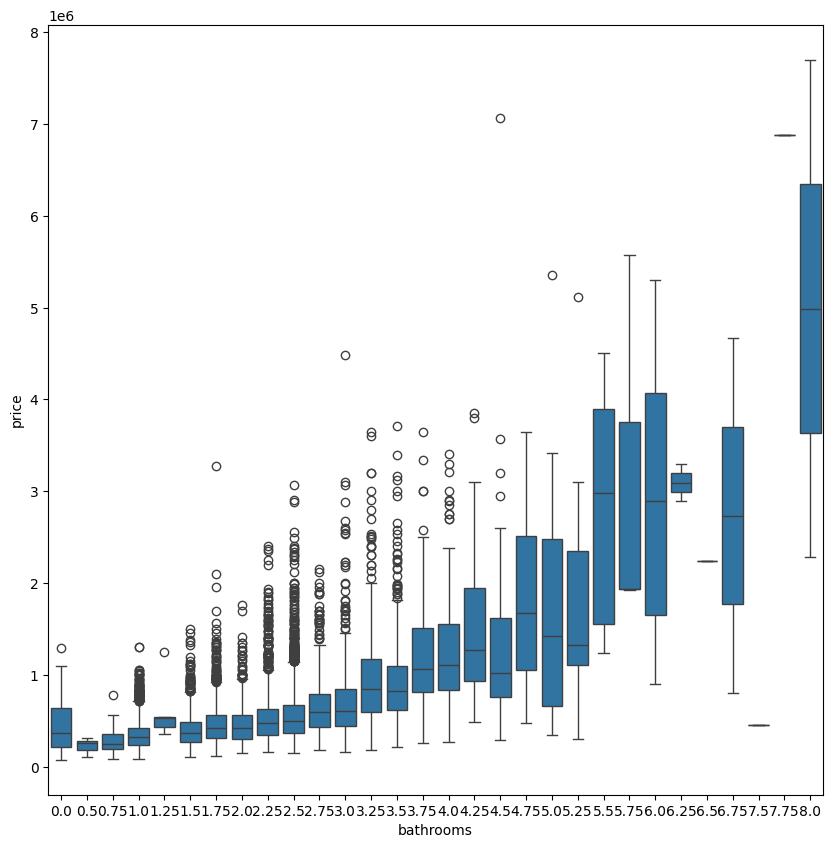

# Housing-Price-Prediction

## Abstract
Accurate sales forecasts can help develop investment strategies to maximize profits. This project will use multiple regression analysis to forecast home prices in King County, Washington, USA. The King County Housing prices data was analyzed, tested, and modeled. Training data will be explored for feature construction, and the final model will be built and trained by the SciKit Python library.      
                              
The project will take the following steps:
- Check the data for completeness and consistency and cleaning the data
- Perform statistical analysis to determine important features
- Visualize the features
- Perform feature engineering
- Train regression models and evaluate each model

## Dataset Description:

| Column | Description |
| ----------- | ----------- |
| id | unique ID for a house |
| date | Date day house was sold |
| price | Price is prediction target |
| bedrooms | Number of bedrooms |
| bathrooms | Number of bathrooms |
| sqft_living | square footage of the home |
| sqft_lot | square footage of the lot |
| floors | Total floors (levels) in house |
| waterfront | Whether house has a view to a waterfront |
| view | Number of times house has been viewed |
| condition | How good the condition is (overall) |
| grade | overall grade given to the housing unit, based on King County grading system |
| sqft_above | square footage of house (apart from basement)|
| sqft_basement | square footage of the basement |
| yr_built | Year when house was built |
| yr_renovated | Year when house was renovated |
| zipcode | zip code in which house is located |
| lat | Latitude coordinate |
| long | Longitude coordinate |
| sqft_living15 | The square footage of interior housing living space for the nearest 15 neighbors |
| sqft_lot15 | The square footage of the land lots of the nearest 15 neighbors |

## Data Analysis

The exploratory phase will also focus on the questions such as:    
What location in the county has the highest property value?      
Which neighborhoods contain the most valuable real estate?
What aspects of the property bring value?
Do renovations affect property values?

Analyzing the average property values per zip code shows the neighborhood with the highest average property values. Most properties in these neighborhoods double the average property value of King County with the average property.
Furthermore, Medina has the highest price the average property value in Medina is about quadrupling that of King County average.

The distribution is positively skewed. Most homes are priced around $500,000; few are priced over 2 million.

Sqft_living has the highest positive correlation with price.
Price has a high positive correlation with bathrooms, grade, sqft_above, and sqft_living15.
Price has a low positive correlation with bedrooms, floors, waterfront, view, sqft_basement, and latitude.
Price has no clear relationship with sqft_lot, condition, house_age, yr_renovated, zipcode, longitude, and sqft_lot15.

## Modeling
Use the Scikit-learn package and apply these 4 models:
1. Linear Regression 
2. RandomForestRegressor 
3. SGDRegressor 
4. Ridge Regression
**Recursive Feature Elimination** is utilized to eliminate unnecessary features in iteration.
Hypothetically, this model should offer a more accurate model. However, the results show otherwise below, and only SGDRegressor caused increasing the accuracy.
It was determined that the RandomForestRegressor without Recursive Feature Eliminiation model performed the best and the SGDRegressor performed the worst without Recursive Feature Eliminiation.